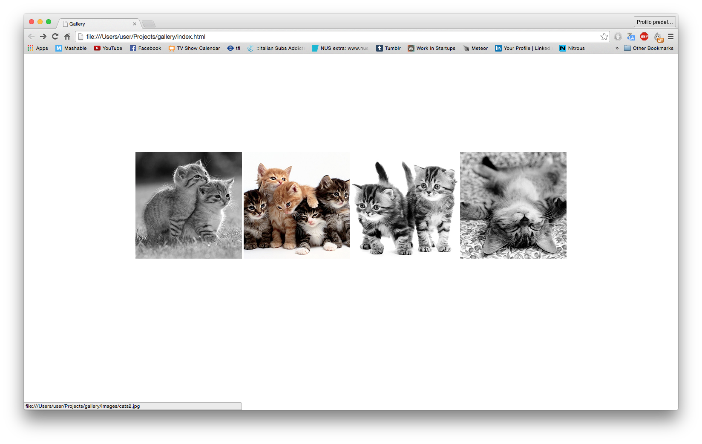
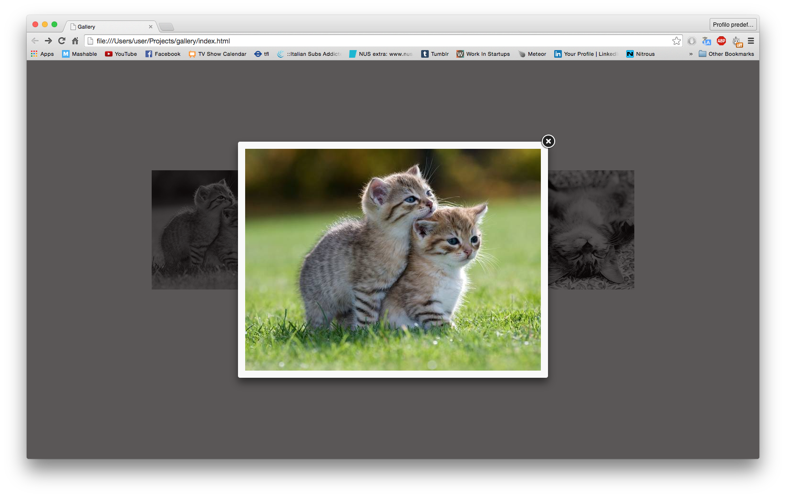

Gallery
=======

A small application built to understand how to create an image gallery using <i>fancybox</i>.




Technologies:
-------------
- HTML
- CSS
- JavaScript
- Fancybox

How to use:
-----------
Clone the directory:
```shell
$ git clone https://github.com/elenagarrone/gallery.git
```

Change into it:
```shell
$ cd gallery
```

Try it on localhost:
```shell
$ open index.html
```
